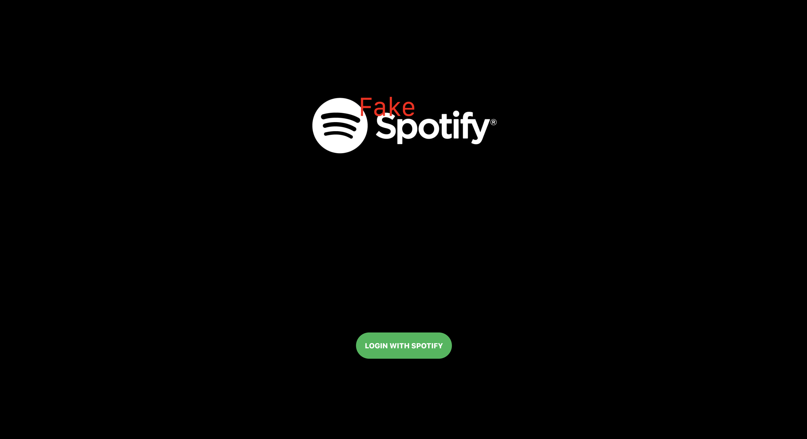
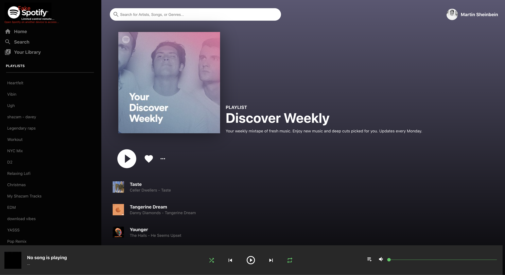

# **Spotify Clone**

### Click the link to view the website

[Spotify Clone Webstite](https://spotify-clone-ds.web.app)

### About Us

##### Frontend UI Spotify Clone built utilizing React, Spotify API, SASS, and more. Hosted utilizing Firebase.

##### Limited control functionality -   Open Spotify on another device to access...

###### Pause/Play functionality and access to weekly Discover Weekly playlist

#### Project Work:

##### https://github.com/davesheinbein

#### LinkedIn:

##### https://www.linkedin.com/in/david-sheinbein/

## Screenshot:

[Login Page Sceenshot](https://imgur.com/0fzb2on)

[Playlist Page Sceenshot](https://imgur.com/Xb4jPyY)

## Technologies Used:

##### 1. HTML5

##### 2. CSS

##### 3. Sass

##### 4. JavaScript

##### 5. React

<!-- V helps fix prop drilling V -->

##### 6. React Context API

##### 7. Node.js

##### 8. Git

##### 9. Firebase

## Potential Next Steps:

##### - [] Add more functionality and access - i.e. access other playlist, play songs directly, etc...

##### - [] Update CSS further to make responsive on all size screens

### Click the link to view David Sheinbeins Portfolio website

[David Sheinbein Portfolio Webstite](http://www.davidsheinbeinportfolio.com/)
